# TP3 - Spring IoC & Injection de Dépendances (OCP)

## 📌 Description

Ce travail pratique a pour objectif de mettre en œuvre le principe de **l’inversion de contrôle (IoC)** et de **l’injection de dépendances (DI)** avec le framework **Spring**.

Le TP démontre comment **changer dynamiquement l’implémentation d’une dépendance (`IDao`) sans modifier la classe métier (`MetierImpl`)**, en respectant le principe **OCP (Open/Closed Principle)**.

---

## 🎯 Objectifs

* Comprendre **IoC (Inversion of Control)**
* Maîtriser **l’injection de dépendances avec Spring**
* Appliquer le principe **OCP**
* Utiliser différentes stratégies de sélection d’implémentation :

    * Profils Spring (@Profile)
    * Configuration Java (@Bean)
    * Propriétés externes (app.properties)

---

## 🧱 Architecture du projet

Le projet est structuré en 3 couches :

* **DAO** : accès aux données
* **Métier** : logique applicative
* **Présentation** : exécution de l’application

```
src
├── dao
│   ├── IDao.java
│   ├── DaoImpl.java
│   ├── DaoImpl2.java
│   ├── DaoFile.java
│   └── DaoApi.java
│
├── metier
│   ├── IMetier.java
│   └── MetierImpl.java
│
├── config
│   ├── DaoAliasConfig.java
│   └── PropertyDrivenConfig.java
│
├── presentation
│   └── Presentation2.java
│
└── resources
    └── app.properties
```

---

## ⚙️ Fonctionnement du projet

La classe métier :

```java
@Autowired
private IDao dao;
```

👉 Spring injecte automatiquement une implémentation de `IDao`.

Le calcul métier :

```java
return dao.getValue() * 2;
```

---

## 🧪 Implémentations DAO

| Classe   | Valeur retournée |
| -------- | ---------------- |
| DaoImpl  | 100              |
| DaoImpl2 | 150              |
| DaoFile  | 180              |
| DaoApi   | 220              |

---

## 🔵 Variante A — @Profile

Chaque DAO est annoté avec :

```java
@Profile("prod")
```

Activation dans `Presentation2` :

```java
ctx.getEnvironment().setActiveProfiles("prod");
```

---

## 🟢 Variante B — @Bean (Alias)

Créer un bean personnalisé :

```java
@Bean(name = "dao")
public IDao daoAlias() {
    return new DaoApi();
}
```

👉 Permet de changer l’implémentation via la configuration Java.

---

## 🟡 Variante C — app.properties

Fichier :

```
src/main/resources/app.properties
```

```properties
dao.target=daoApi
```

Configuration :

```java
@PropertySource("classpath:app.properties")
```

👉 Spring sélectionne dynamiquement le DAO selon la propriété.

---

## 🧾 Journalisation (Debug)

Ajout dans `MetierImpl` :

```java
@PostConstruct
public void init() {
    System.out.println("[TRACE] DAO injecté = " + dao.getClass().getSimpleName());
}
```

👉 Permet de vérifier l’implémentation injectée.

---

## ▶️ Exécution
varianve A
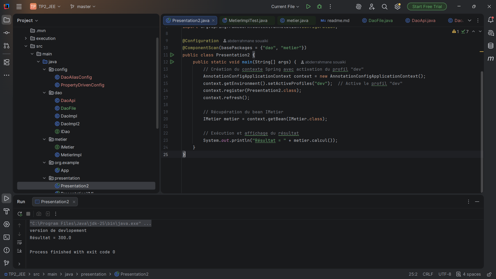
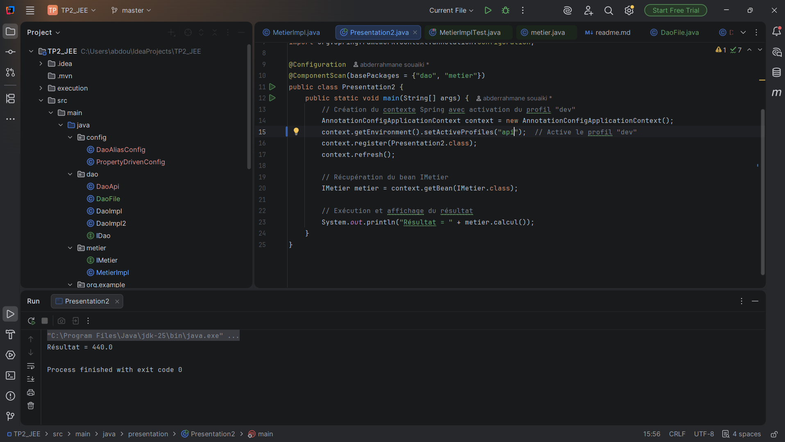
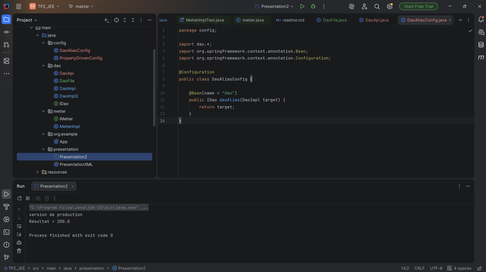
variance B
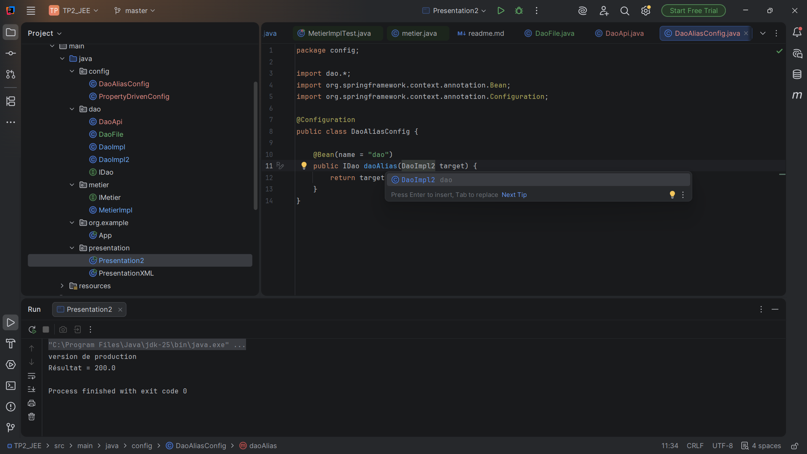
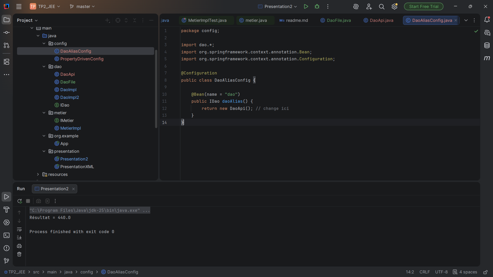
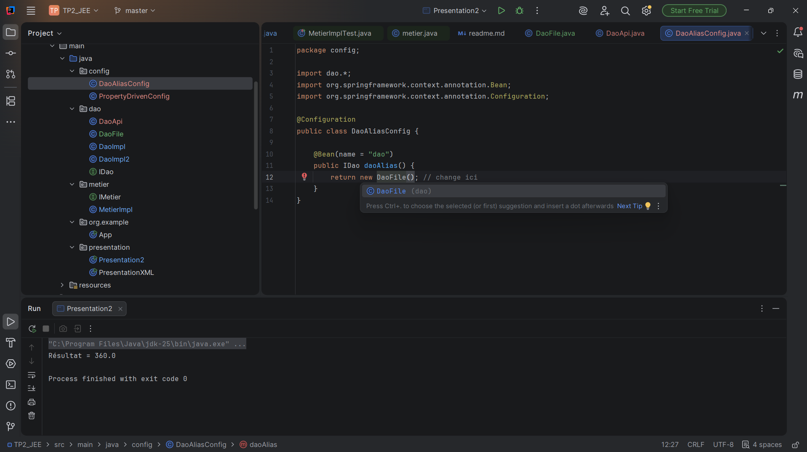
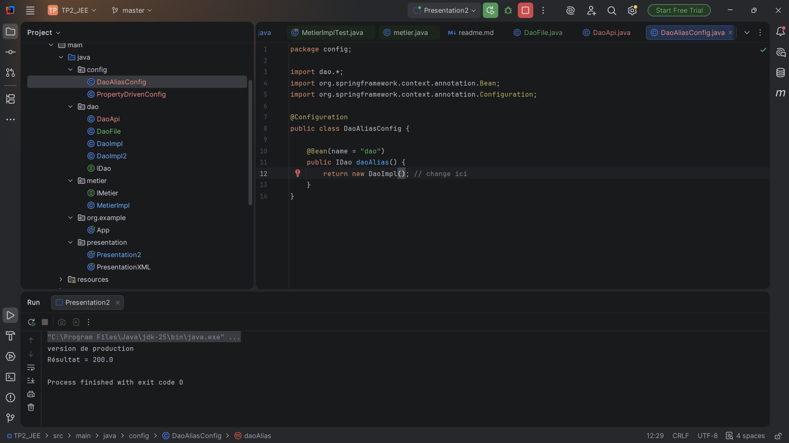
variance C
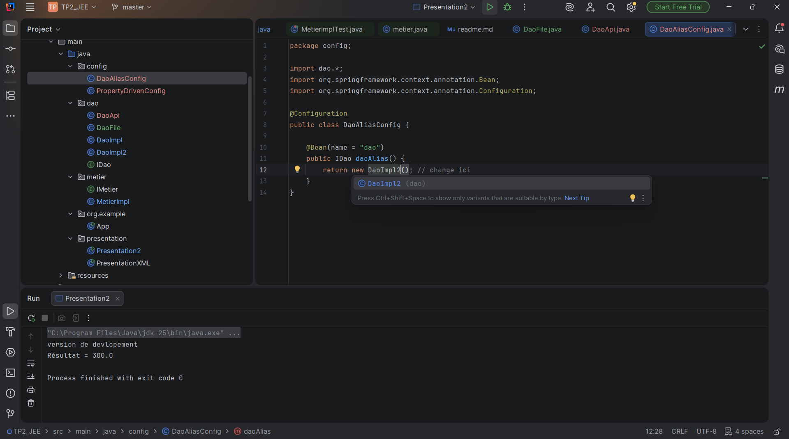
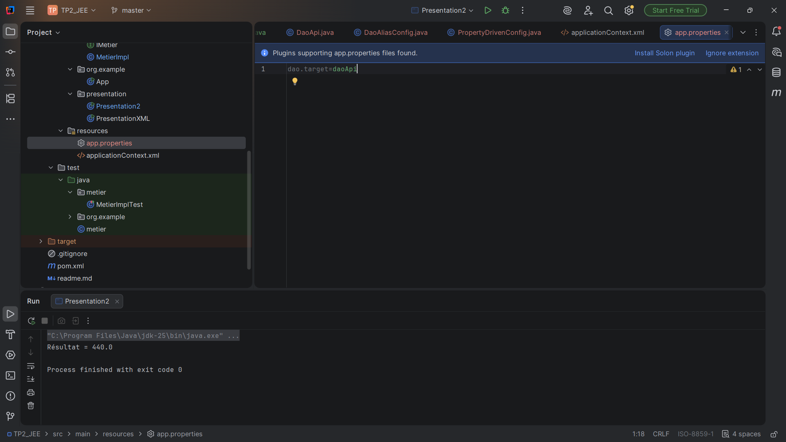
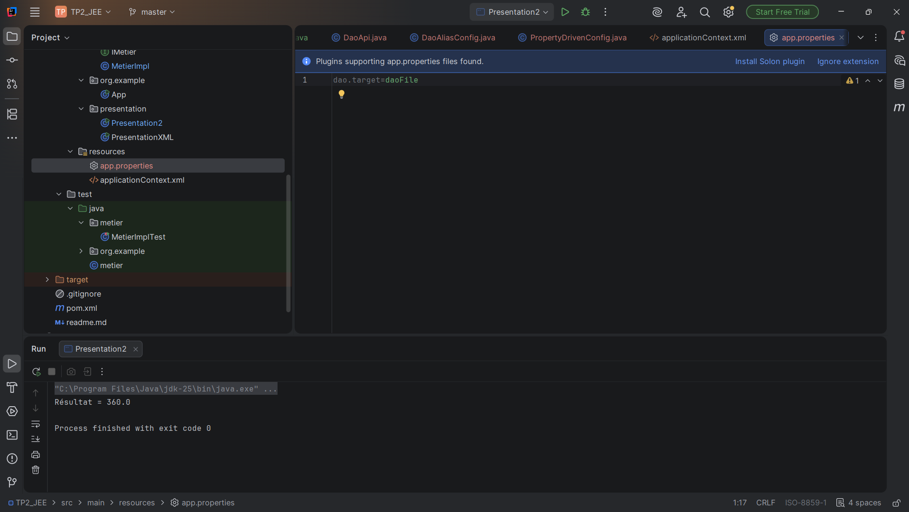
derniere methode
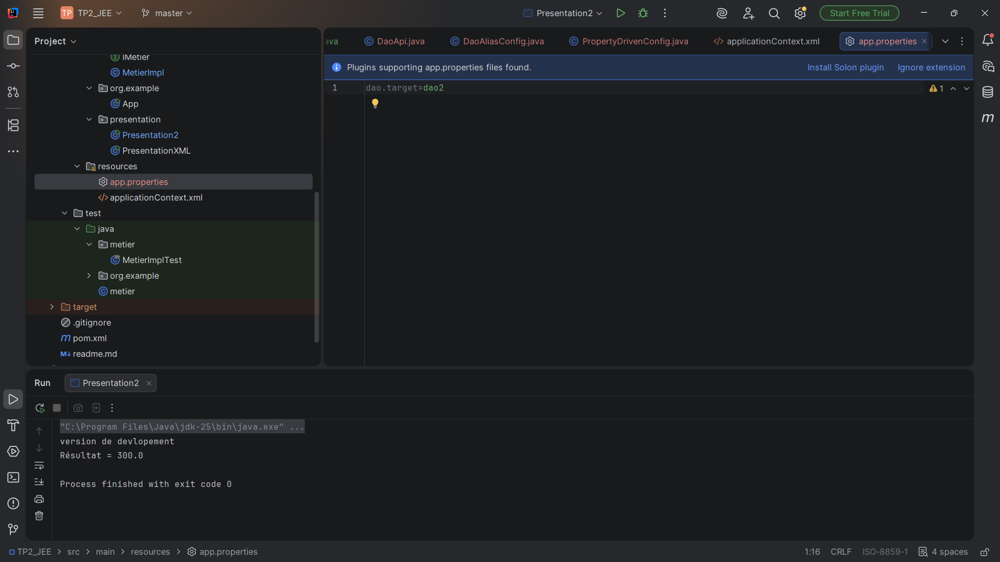
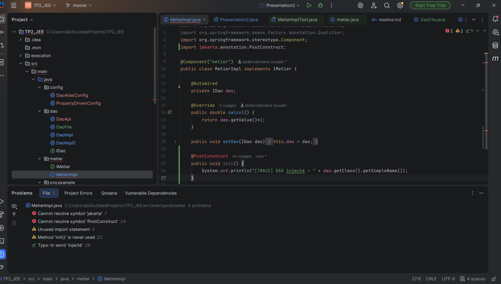
---

## 🧪 Résultats attendus

| dao.target | Résultat |
| ---------- | -------- |
| dao        | 200      |
| dao2       | 300      |
| daoFile    | 360      |
| daoApi     | 440      |

---

## ⚠️ Règles importantes

* ❌ Ne pas modifier `MetierImpl`
* ❌ Ne pas utiliser `@Qualifier`
* ✔️ Utiliser uniquement la configuration pour changer le DAO

---

## ✅ Conclusion

Ce TP illustre la puissance de Spring pour :

* découpler les composants
* changer le comportement sans modifier le code
* respecter le principe **OCP**

---

## 👤 Auteur

**Abderrahmane Souaiki**
